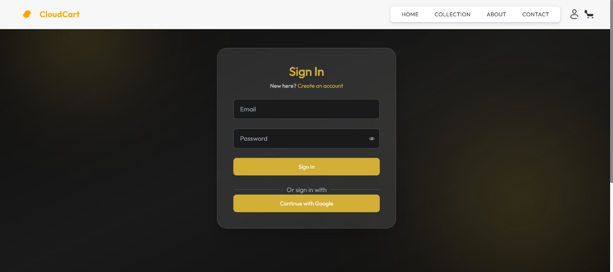

# 🛒 Microservices-Based E-Commerce Platform
    
This project implements a scalable and modular **E-Commerce Web Application** using **Microservices Architecture**. Developed as part of the **Virtualization and Cloud Computing** course at **IIIT Dharwad**, it demonstrates best practices in containerization, service orchestration, and cloud-native development.

---

## 🧩 Microservices Overview

The system is decomposed into independently deployable microservices:

| Service           | Responsibility                                    |
|-------------------|--------------------------------------------------|
| **API Gateway**    | Entry point for all requests, routes to services |
| **Auth Service**   | User authentication & authorization              |
| **Product Service**| Manage products, availability & updates          |
| **Order Service**  | Process customer orders and track inventory      |
| **RabbitMQ**       | Message broker for async communication           |
| **Frontend**       | Customer-facing web application                  |
| **Admin Panel**    | Admin dashboard for product management           |

---

## 🏗️ Software Architecture

### 📐 High-Level Design

- **API Gateway**: Centralized routing, load balancing, and service exposure.
- **MongoDB**: Each service maintains its own database, ensuring data autonomy.
- **RabbitMQ**: Event-driven communication enables async updates and decoupling.


## ⚙️ Tech Stack

| Technology          | Purpose                                   |
|---------------------|-------------------------------------------|
| **Node.js**         | Backend runtime (microservices)           |
| **Express.js**      | RESTful API development                   |
| **React.js + Vite** | Frontend SPA development                  |
| **MongoDB**         | NoSQL data storage                        |
| **RabbitMQ**        | Message broker (AMQP)                     |
| **Docker**          | Containerization of services              |
| **Docker Compose**  | Local orchestration                       |

---

## 🪜 Implementation Steps

### ✅ Step 1: Requirement Gathering & Planning
- Define project scope, user requirements, and technology stack.
- Identify key microservices and cloud infrastructure needs.

### ✅ Step 2: Microservices Design & Database Setup
- Develop API contracts and database schemas (MongoDB).
- Establish cloud-based database connections and backup mechanisms.

### ✅ Step 3: API Development & Integration
- Build RESTful APIs for user authentication, product catalog, shopping cart, and orders.
- Implement API Gateway for secure and efficient communication.

### ✅ Step 4: UI/UX Implementation
- Design responsive and user-friendly web interfaces.

---
🌐 Access Points
Component         URL
Frontend UI       http://localhost:5173
Admin Dashboard	http://localhost:3030

## 🚀 Running the Application

### 🐳 Using Docker (Recommended)

```bash
# Build the images
docker-compose build

# Start all services
docker-compose up
```

### 🧪 Local Development 
```bash
# Clone the repository
git clone <repo-url>
cd <project-directory>

# Install dependencies for each service
cd backend/<service-name>
npm install

# Start service
npm start
```
### 👨‍💻 Contributors

- Rachakonda Shrutik Sai (22BCS096)  
- Sandeep D S (22BCS110)  
- Shaik Guffran Ahmed (22BCS112)  
- T.V.V Sai Karthik (22BCS129)

### Screenshots




